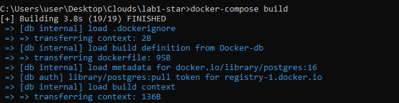
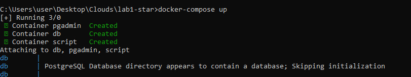
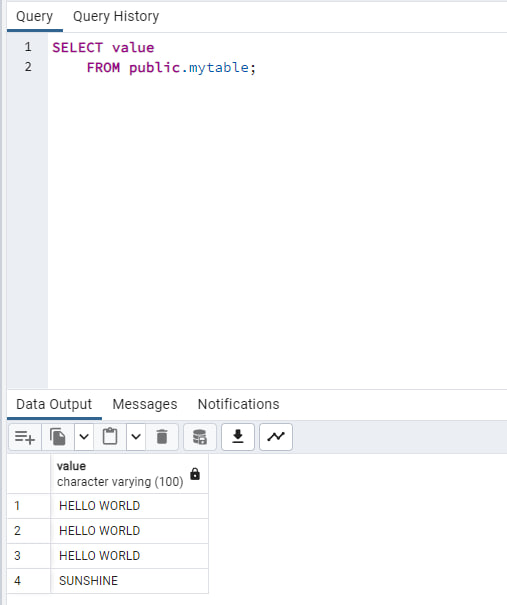

# Лабораторная работа №1* "Работа с Dockerfile*"

## Выполнили: 
Булаев Дмитрий K34211, Мелких Дмитрий K34211

## Цель работы:
Реализовать приложение в запущенном контейнере, записывающее изменения в базу данных.

## Задачи:
* Написать программу, которая записывает в базу данных переданное в команде запуска значение.
* Реализовать docker-compose файл для сборки всех необходимых для работы проекта компонентов.
* Протестировать работу развернутого проекта.      

## Ход работы
 
Для начала реализуем программу на python, добавляющую значения в базу данных. Программа будет принимать значения из переменных окружения, которые будут созданы при реализации контейнера. Эти значения будут использоваться, во-первых, для подключения к базе данных, а, во-вторых, для добавления новых данных. Код программы можно увидеть здесь - [app.py](./app.py) 

Далее реализуем Dockerfile под названием [Docker-script](./Docker-script), в котором опишем контейнер для запуска [app.py](./app.py). В нем будет испольваться исходный образ python:3.8-slim, а необходимые для работы программы библиотеки взяты из файла [requirements.txt](./requirements.txt).

```
FROM python:3.8-slim

MAINTAINER Dmitries

LABEL version='1.0'

WORKDIR /home

COPY requirements.txt .
RUN apt-get update && \
    apt-get install -y python3 && \
    useradd -m dmitrii && \
    pip install -r requirements.txt

USER dmitrii

COPY app.py . 

ENTRYPOINT ["python3", "app.py"]
```

Далее опишем Dockerfile под названием [Docker-bd](./Docker-db), в котором опишем контейнер для базы данных postgreSQL. Исходным образом послужит postgres:16, а код для создания таблицы mytable, куда и будут записываться значения, возьмем из файла [db.sql](./db/db.sql).

```
FROM postgres:16

COPY ./db/ /docker-entrypoint-initdb.d/
```
Далее создадим файл [docker-compose.yml](./docker-compose.yml) в котором опишем опции, необходимые для запуска все контейнеров. Помимо двух, описанных выше контейнеров мы будем использовать также образ dpage/pgadmin4, для запуска pgAdmin, где мы сможем протестировать, добавлись ли значения в бд или же нет. Для сохранения добавленных данных в бд будет использовать volumes - тома, с помощью которых можно реализовать хранилище данных внутри контейнера.

```
version: '3'

services:
  script:
    container_name: script
    build:
      context: .
      dockerfile: Docker-script
    environment:
      POSTGRES_DB: db
      POSTGRES_USER: dmitrii
      POSTGRES_PASSWORD: dmitrii
      POSTGRES_HOST: db
      POSTGRES_PORT: 5432
      VALUE: 'SUNSHINE'
    depends_on:
      - db

  pgadmin:
    container_name: pgadmin
    image: dpage/pgadmin4
    environment:
      PGADMIN_DEFAULT_EMAIL: dmitrii@boom.com
      PGADMIN_DEFAULT_PASSWORD: dmitrii
    ports:
      - '5050:80'

  db:
    container_name: db
    build:
      context: .
      dockerfile: Docker-db
    volumes:
      - db_data:/var/lib/postgresql/data
    environment:
      POSTGRES_DB: db
      POSTGRES_USER: dmitrii
      POSTGRES_PASSWORD: dmitrii
    ports:
      - "5432:5432"
volumes:
  db_data: 
```

После реализации всех 'волшебных' файлов запустим наш docker-compose файл. Для этого последовательно выполним следующие команды:

```
docker-compose build
```



```
docker-compose up
```



После успешного запуска всех контейнеров несколько раз перезапустим контейнер script, для того, чтобы в бд записалась несколько значений.

Перейдем по адресу [http://localhost:5050](http://localhost:5050), для того чтобы подключиться к pgAdmin. Зарегистрируем внутри pgAdmin поднятый нами сервер db с одноименной базой данных db и выполним SELECT скрипт из единственной созданной таблицы - mytable.



Как мы видим, значения успешно записались. Отметим, что при перезапуске контейнеров все значения сохраняются. Все контейнеры останавливались, а после перезапускались уже с новым значением VALUE для нашей программы. Это можно также заметить на скриншоте выше.


## Вывод:
В ходе выполнения лабораторной работы была реализована программа для записи полученных из окружения значений в базу данных, а также создан файл docker-compose для запуска всех, необходимых для работы проекта, контейнеров. Проект был протестирован - все сработало успешно. В ходе выполнения лабораторной работы проблем не возникло. 