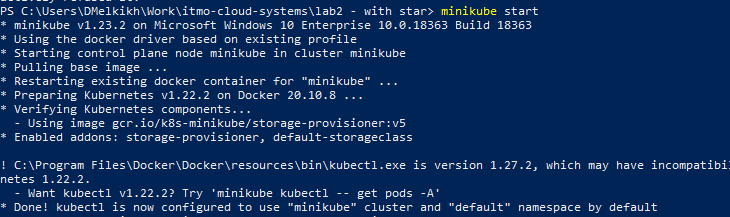
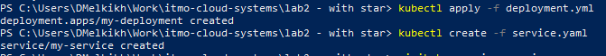
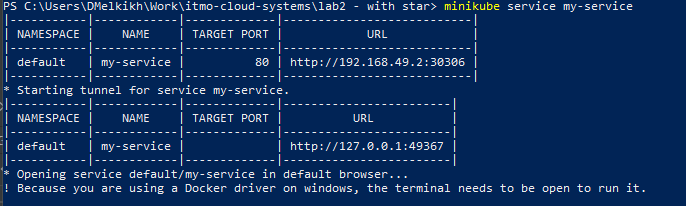
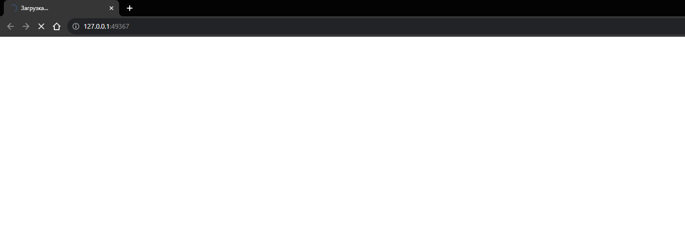

## Лабораторная работа 2

## Цель работы:
Поднять kubernetes кластер локально, в нём развернуть свой сервис, используя 2-3 ресурса kubernetes

## Задачи:
* Написать YAML файлы для быстрого разворачивания узлов;
* Поднять кластер в minikube c двумя ресурсами.

## Ход работы

Для начала установим minikube с помощью exe файла с официального сайта


Запустим minikube командой
  ```
  minikube start
  ```



Далее напишем deployment.yaml: 


В нем указано replicas: 2, что означает, что в кластере будет создано два данных объекта.

Далее создадим service.yaml. В роли сервиса будет выступать NodePort: 


Далее соберем и развернем наши ресурсы в minikube: 





Как видно на картинке выше, minikube вывел нам IP и порт по которому мы можем получить доступ к сервису.

Помимо этого, в браузере автоматически открылась вкладка с нашим сервисом:



## Вывод
В ходе выполнения данной лабораторной работы были подняты 2 сервиса в кластере minikube.
Развернуты они были с помощью описанных yaml файлов.

