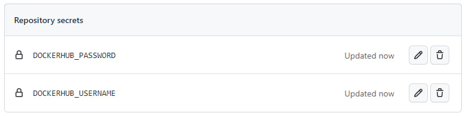
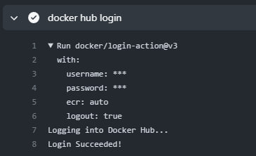

# Лабораторная работа №3* "Работа с CI/CD*"

## Выполнили: 
Булаев Дмитрий K34211, Мелких Дмитрий K34211

## Цель работы:
Использовать секреты в реализации CI/CD.

## Задачи:
* Настроить работу CI/CD c использованием секретов. 

## Ход работы

Так как в предыдущей работе мы настраивали работу CI/CD в рамках Github с использованием Github Actions, то логично было бы использовать для использования секретов также средство Github под названием Github Secrets.

Настроим наши секреты, в которых будем хранить логим и пароль от Docker Hub.

Перейдем в наш репозиторий, в раздел `Setting/Secrets and variables/Actions` и добавим два новых секрета:



Значения секретов просмотреть нельзя - только отредактировать или удалить.

Далее добавим эти секреты в файл настройки сценария lab3.yml из предыдущей работы в step где мы авторизовываемся в Docker Hub:

```
- name: docker hub login
    uses: docker/login-action@v3
    with:
        username: ${{ secrets.DOCKERHUB_USERNAME }}
        password: ${{ secrets.DOCKERHUB_PASSWORD }}
```

Далее запушим какое-нибудь изменения в директорию lab3 и убедимся, что в логах выполнения сценария эти секреты не раскрываются:



Как можем увидеть, данные действительно заменены на звездочки (скрыты). Таким образом можно сделать вывод, что цель работы достигнута.

## Вывод:
В ходе выполнения лабораторной работы был настроен CI/CD с использованием секретов Github Secrets. Во время выполнения работы проблем не возникло. 
