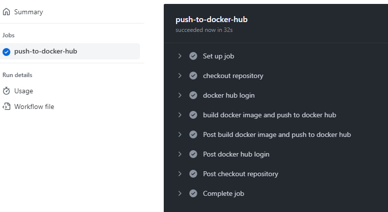

# Лабораторная работа №3 "Работа с CI/CD"

## Выполнили: 
Булаев Дмитрий K34211, Мелких Дмитрий K34211

## Цель работы:
Сделать, чтобы после пуша в репозиторий автоматически собирался docker-образ и результат его сборки сохранялся в Docker Hub

## Задачи:
* Настроить работу CI/CD в рабочем репозитории 
* Протестировать работу настроенной CI/CD 

## Ход работы

### Настройка CI/CD

Так как наш рабочий репозиторий находится в Github, то лучшим способо для настройки CI/CD будет Github Action.

Для того, чтобы настроить Github Action, создадим файл с разрешением .yml в папке .github/workflows/.

Содержимое созданного файла [lab3.yml](/.github/workflows/lab3.yml) выглядят следующим образом:

```
name: lab3 

on:
  push:
    branches: ["main"]
    paths:
      - "lab3/**"

jobs:
  push-to-docker-hub:
    runs-on: ubuntu-22.04

    defaults:
      run:
        working-directory: "/lab3"

    steps:
      - name: checkout repository
        uses: actions/checkout@v4

      - name: dockerhub login
        uses: docker/login-action@v3
        with:
          username: ${{ secrets.DOCKERHUB_USERNAME }}
          password: ${{ secrets.DOCKERHUB_PASSWORD }}

      - name: build docker image and push to docker hub
        uses: docker/build-push-action@v5
        with:
          context: "./lab3/"
          push: true
          tags: dramaerr/hello-user-image:latest
```

Разберем подробнее созданный файл.

* ### name

Здесь мы указываем название сценария, которое будет отображаться в разделе Actions на странице репозитория в Github.

```
name: lab3 
```

* ### on

Здесь прописывам правила, которые определяют запуск сценария. В нашем случае настроен запуск сценария при выполнения пуша в ветку main в папку lab3 текущего репозитория.

```
on:
  push:
    branches: ["main"]
    paths:
      - "lab3/**"
```

* ## jobs

В этом отделе опишем задачу, которая будет выполняться при запуске сценария. Дадим ей имя push-to-docker-hub и укажем, что задача будет запускаться на образе ubuntu-22.04. Так же зададим базовую директорию для выполнения задачи: lab3/

```
jobs:
  push-to-docker-hub:
    runs-on: ubuntu-22.04

    defaults:
      run:
        working-directory: "/lab3"
```

Далее опишем шаги - steps, которые будут последовательно выполняться в процессе выполнения задачи:

1. Предоставим доступ нашему образу к рабочему репоизторию:

```
- name: checkout repository
  uses: actions/checkout@v4
```

2. Авторизуемся в Docker Hub используя секреты, сохранённые в Github Secrets. Для авторизации будет использовать логин и пароль

```
- name: dockerhub login
  uses: docker/login-action@v3
  with:
    username: ${{ secrets.DOCKERHUB_USERNAME }}
    password: ${{ secrets.DOCKERHUB_PASSWORD }}
```
 
3. Соберем необходимый образ и запушим его в Docker Hub, указав при этом название репозитория и версию.

```
- name: build docker image and push to docker hub
  uses: docker/build-push-action@v5
  with:
    context: "./lab3/"
    push: true
    tags: dramaerr/hello-user-image:latest
```

### Тестирование

Запушим какое-либо изменения в папку lab3 и проследим за тем, что бы задача выполнилась корректно:

1. Выполнение задачи:



2. Проверим, запушился ли образ в Docker Hub:


3. Попробуем запустить запушенный образ на своем ноутбуке:


Как видим, все сработало успешно, а значит цель работы достигнута.

## Вывод:
В ходе выполнения лабораторной работы был настроен CI/CD, благодаря которому после пуша в рабочий репозиторий создавался docker-образ и сохранялся в Docker Hub. Во время выполнения работы проблем не возникло. 
