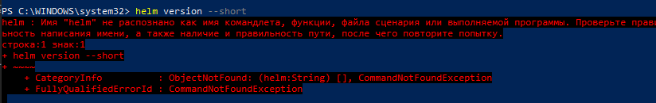
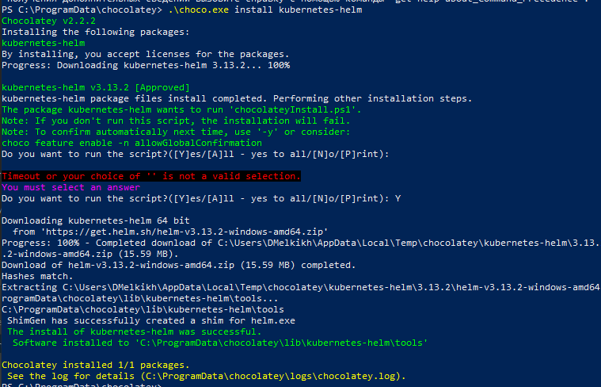
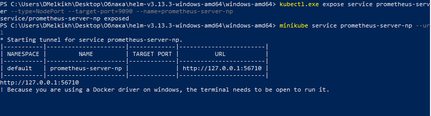
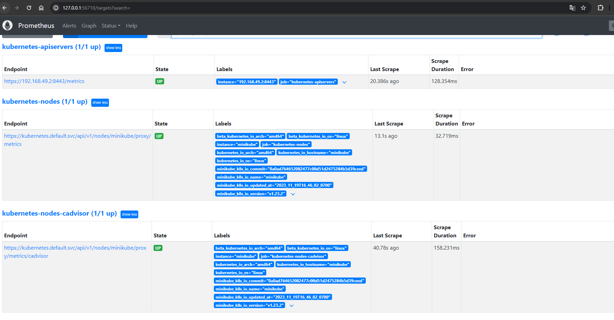
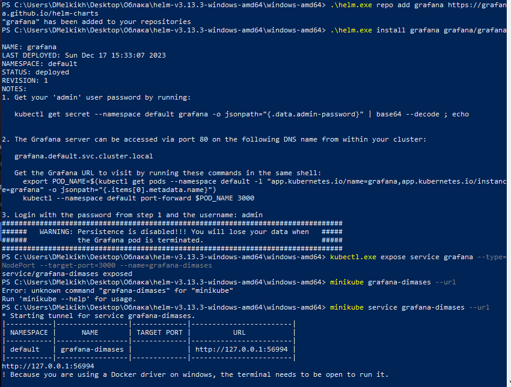
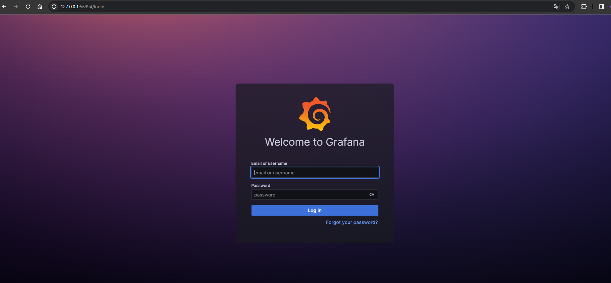
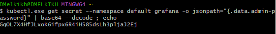
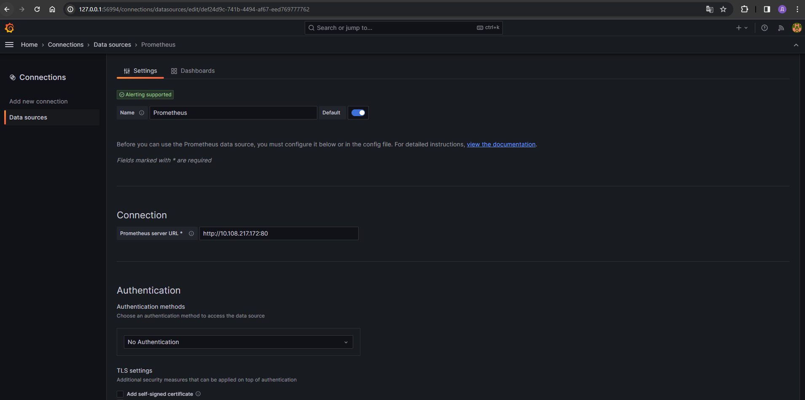
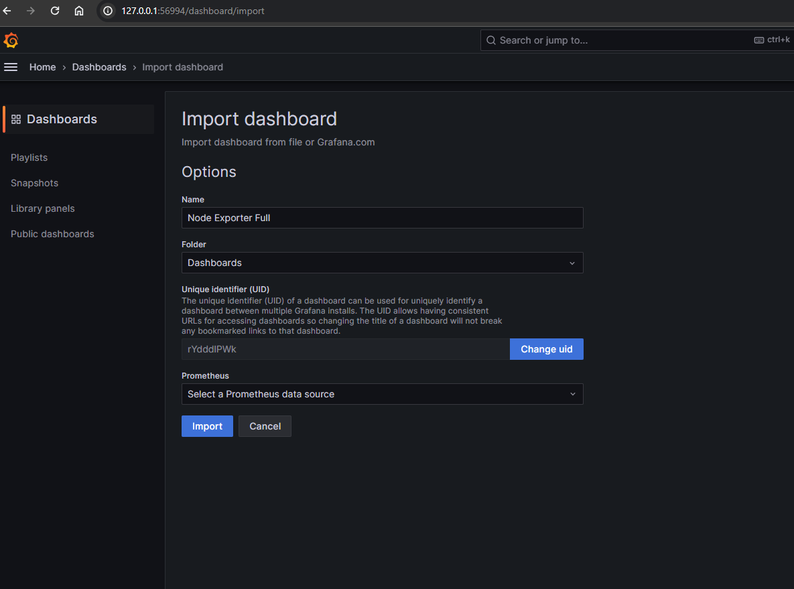
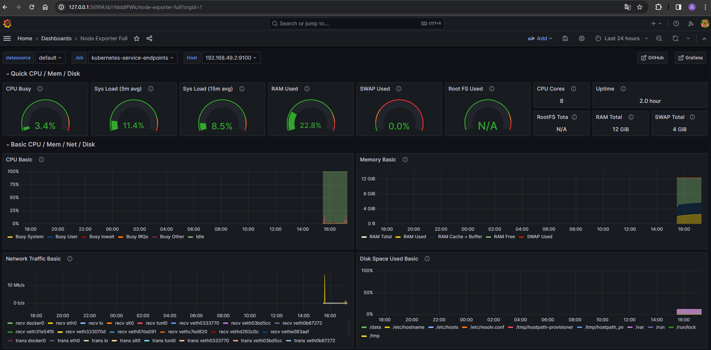

# Лабораторная работа №4 "Мониторинг сервиса, поднятого в кубере"

## Выполнили:
Булаев Дмитрий K34211, Мелких Дмитрий K34211

## Цель работы:
Сделать мониторинг сервиса, поднятого в kubernetes

## Задачи:
* Локально установить Prometheus
* Локально установить Grafana
* Зафиксировать два графика, отображающих состояние системы

## Ход работы

Для начала проверим, установлен ли helm на нашей машине



Увидим, что не установлен. Скачаем и установим helm.



Далее с помощью helm добавим репозиторий и установим prometheus:

```
helm repo add prometheus-community https://prometheus-community.github.io/helm-charts
helm install prometheus prometheus-community/prometheus
```

Аналогично установим grafana:

```
helm repo add grafana https://grafana.github.io/helm-charts
helm install grafana grafana/grafana
```

Далее запустим prometheus:
```
kubectl expose service prometheus-server --type=NodePort --target-port=9090 --name=prometheus-server-np
```

Чтобы подключиться к веб-интерфейсу prometheus, воспользуемся параметром --url.



Посмотрим через браузер как работает prometheus



Далее запустим grafana:
```
kubectl expose service grafana --type=NodePort --target-port=3000 --name=grafana-dimases
```
Аналогично воспользуемся параметром --url


В веб-интерфейсе grafana увидим авторизацию:



Получим пароль для admin с помощью команды (через powershell не получилось, поэтому использовали git cmd):



После авторизации укажем prometheus как Datasource для grafana:



Далее импортируем дашборд Node Exporter Full:



В результате увидим графики состояния системы:



## Вывод:
В ходе выполнения работы были установлены prometheus и grafana, были построены графики отражающие состояние системы. Во время выполнения работы проблем не возникло. 
